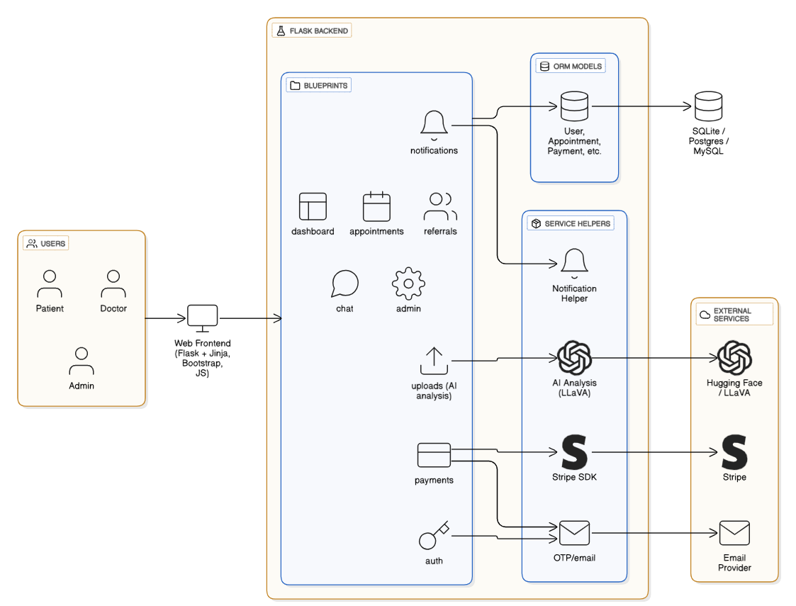
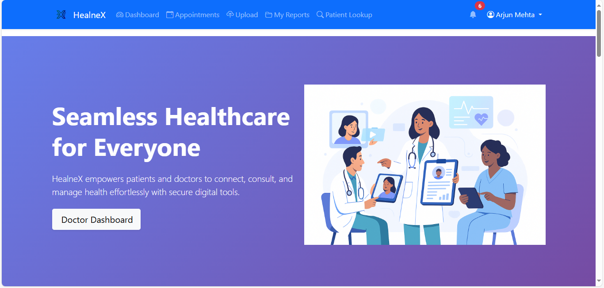
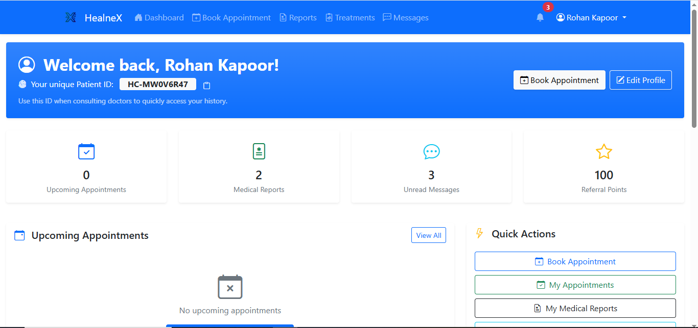
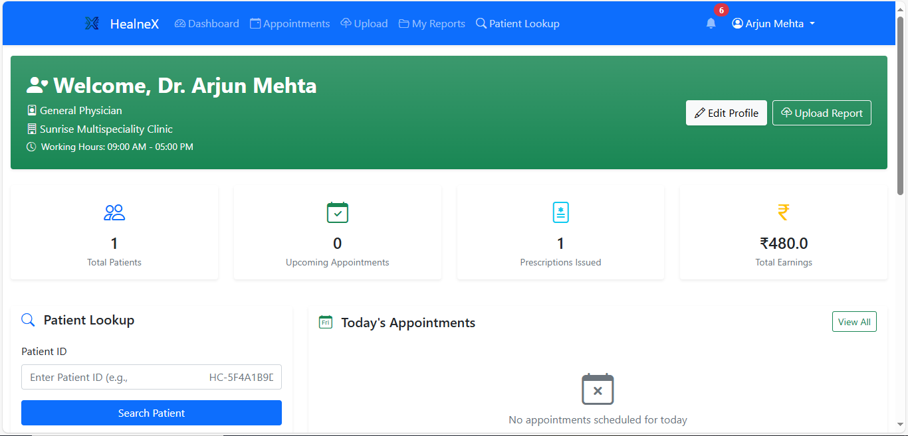
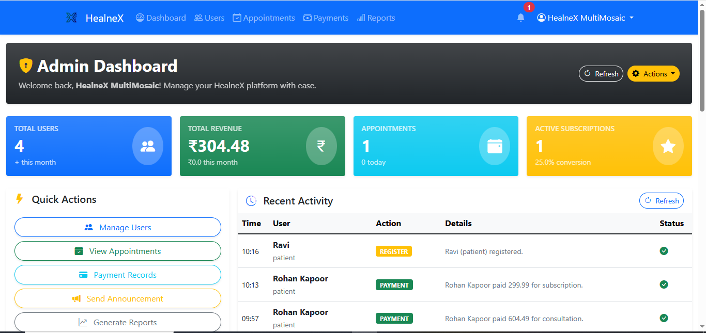

# HealneX

> Unified digital healthcare that connects patients, doctors, and administrators with teleconsultations, health records, payments, and engagement tools in one place.

> **Live deployment:** https://healnex.onrender.com *(Render free tier – email/OTP delivery is enabled but can fail because of memory limits; the feature works as expected on local deployments.)*

## Project Title & Tagline
- **Project:** HealneX
- **Tagline:** "Seamless healthcare access wherever patients and clinicians are."

## Problem Statement
Millions of people across rural and semi-urban India still face fragmented care, disconnected medical records, opaque pricing, and distrust of digital consultations. Clinics struggle with overcrowding, manual scheduling, and a lack of follow-up infrastructure. Without an integrated, secure, and affordable telehealth ecosystem, patients experience delayed diagnoses and financial strain while providers face burnout and inefficiencies.

## Solution Overview
HealneX is a unified healthtech platform that merges teleconsultation, electronic health records, secure billing, referrals, and engagement features under a single workflow. Patients can discover specialists, book and pay for visits, chat or join teleconsultations, and maintain lifelong records. Clinicians manage schedules, prescriptions, payouts, referrals, and treatment plans from role-specific dashboards. Administrators monitor platform growth with analytics, announcements, and configuration tools.

**Innovation & Impact**
- Integrated OTP-based onboarding, unique patient IDs, and Stripe-backed payments build trust and accountability.
- AI-assisted document analysis (LLaVA vision-language model) turns uploaded lab reports into structured clinical insights.
- Referral gamification reduces cost barriers for patients while boosting adoption.
- Modular blueprints and service helpers make the system cloud-ready and easy to extend during the hackathon timeline.

## Tech Stack
- **Frontend:** Flask with Jinja templates, Bootstrap 5, custom SCSS/CSS, Vanilla JS.
- **Backend:** Python 3.12, Flask blueprints, Flask-Login, Flask-WTF, Flask-Mail, Flask-Migrate, Flask-SQLAlchemy.
- **Database:** SQLite for local development (configurable to Postgres/MySQL via SQLAlchemy URI).
- **Payments & Billing:** Stripe Checkout, PaymentIntents, and payouts.
- **Messaging & Notifications:** Flask-Mail, in-app notifications, OTP verification, WebSocket-ready chat (currently long-polling via AJAX).
- **AI & Analytics:** Hugging Face Transformers (LLaVA), PyTorch, TensorFlow, PyMuPDF for medical report parsing, Pillow for image processing.
- **Deployment Support:** Gunicorn, environment-driven configuration, CLI helpers (`flask init-db`, `flask seed-db`).

## System Architecture & Workflow

1. **Authentication:** OTP-based login and dual registration flows ensure verified access.
2. **Scheduling:** Patients search active doctors, select slots, and trigger payments or offline confirmations.
3. **Consultation:** Doctors manage queues, mark visits complete, and award treatments; chat and video-call bootstrap provide synchronous touchpoints.
4. **Records & AI:** Doctors upload patient documents, run in-platform AI analysis, and share insights via notifications.
5. **Billing:** Stripe checkout sessions or PaymentIntents finalize transactions, update ledgers, and emit email receipts.
6. **Governance:** Admin dashboards aggregate growth metrics, revenue, announcements, and platform settings.

## Features
- Patient, doctor, and admin role-based dashboards with tailored KPIs.
- OTP-protected login, patient unique IDs, and doctor verification.
- Appointment booking, rescheduling, cancellation, and completion workflows with Stripe or offline payments.
- Subscription plans and referral-driven discounts for frequent users.
- Secure medical file storage with quota enforcement per subscription tier.
- AI-powered medical report analysis leveraging LLaVA vision-language models.
- Real-time chat, video-call scaffolding, notifications, and treatment notes.
- Admin suite covering user governance, revenue analytics, reports, announcements, and system settings.
- Comprehensive email templates for OTP, receipts, contact support, and announcements.

## Installation & Setup
1. **Prerequisites**
   - Python 3.10+ (tested on 3.12).
   - Virtual environment tooling (`python -m venv` or `virtualenv`).
   - SQLite (bundled) or desired RDBMS.
   - Node is not required; all UI assets are compiled.
2. **Clone & Environment**
   ```bash
   git clone https://github.com/shahram8708/HackX_CodeX.git
   cd HackX_CodeX
   python -m venv .venv
   # Windows
   .venv\Scripts\activate
   # macOS/Linux
   source .venv/bin/activate
   ```
3. **Install Dependencies**
   ```bash
   pip install --upgrade pip
   pip install -r requirements.txt
   ```
   > AI analysis uses `torch`, `tensorflow`, and `transformers`.
4. **Environment Variables**
   - Copy `.env.example` (create if not present) and set the variables listed in the configuration guide.
   - Minimum required: `SECRET_KEY`, `MAIL_*`, `STRIPE_*`, `ADMIN_EMAIL`.
5. **Database Setup**
   ```bash
   set FLASK_APP=run.py        # Windows PowerShell
   export FLASK_APP=run.py     # macOS/Linux
   flask init-db               # creates tables via SQLAlchemy
   flask seed-db               # loads default admin user (help@healnex.in)
   ```
6. **Run the App**
   ```bash
   flask run --debug
   # or
   python run.py
   ```
   Visit `http://127.0.0.1:5000`.

## Configuration Guide
| Key | Description | Default | Notes |
| --- | --- | --- | --- |
| `SECRET_KEY` | Flask session secret | `HealneX6708@` | Set to a strong random value in production. |
| `SQLALCHEMY_DATABASE_URI` | Database connection string | `sqlite:///healnex.db` | Point to Postgres/MySQL for staging/prod. |
| `MAIL_SERVER`, `MAIL_PORT`, `MAIL_USE_TLS`, `MAIL_USERNAME`, `MAIL_PASSWORD`, `MAIL_DEFAULT_SENDER` | Email delivery | Gmail defaults | Required for OTP and transactional mails. If unset, emails log to console. |
| `ADMIN_EMAIL` | Site support mailbox | `help@healnex.in` | Used by contact support form. |
| `STRIPE_PUBLISHABLE_KEY`, `STRIPE_SECRET_KEY` | Stripe credentials | placeholders | Needed for subscription and consultation payments. |
| `WTF_CSRF_ENABLED`, `WTF_CSRF_TIME_LIMIT` | CSRF protection | Enabled (1 hour) | Can be disabled in tests. |
| `MAX_CONTENT_LENGTH` | Upload size cap | 16 MB | Adjust for larger medical files. |

Additional optional flags include `FLASK_CONFIG` (switch between development/production/testing configs) and `UPLOAD_FOLDER` (auto-derived from `config.py`).

## Usage
1. **Onboard**
   - Register as patient or doctor; patients receive unique IDs, doctors provide license details.
   - OTP is emailed; with dummy credentials check console logs when mail SMTP is unset.
2. **Administrator**
   - After `flask seed-db`, login with `help@healnex.in` (password `healnex6708@`) to access the admin dashboard.
3. **Book Appointments**
   - Patients search doctors by specialization, pick slots, and pay online (Stripe) or choose offline payment.
   - Doctors confirm, complete, or reschedule visits and add treatment notes with attachments.
4. **Manage Records**
   - Upload prescriptions, lab reports, and treatment plans; run AI analysis for supported formats.
5. **Engage**
   - Use chat for asynchronous updates, check notifications, and share referrals for rewards.
6. **Monitor**
   - Admin view aggregates KPIs, revenue breakdowns, user growth, and allows sending announcements or toggling settings.

## Screenshots / UI Previews








## Demo / Video
- Live site: [HealneX on Render](https://healnex.onrender.com) *(email/OTP sending is active but may intermittently fail on Render's free tier because of memory constraints; it works locally.)*
- Android app: [HealneX APK](app/static/app/healnex.apk) *(sideload on Android to test the companion experience)*
- Pitch & prototype walkthrough: [Hackathon Demo (Google Drive)](https://drive.google.com/file/d/1nly66_IAA88od7tlyZUbigGLEtKWlizv/view?usp=sharing)

## Folder Structure
```
HackX_CodeX
├── app
│   ├── admin/           # Admin blueprint (analytics, announcements, settings)
│   ├── appointments/    # Booking, scheduling, rescheduling workflows
│   ├── auth/            # Login, registration, OTP utilities
│   ├── chat/            # Secure messaging and video-call scaffolding
│   ├── dashboard/       # Patient and doctor dashboards, profile management
│   ├── notifications/   # Notification routes and helpers
│   ├── payments/        # Stripe subscriptions and payments
│   ├── referrals/       # Referral codes, doctor-to-doctor referrals
│   ├── uploads/         # File uploads, AI analysis, storage limits
│   ├── utils/           # Shared helpers (email, decorators, file utilities)
│   ├── models.py        # SQLAlchemy models and relationships
│   └── templates/       # Jinja templates for every module
├── config.py            # Environment-aware configuration classes
├── run.py               # Flask entrypoint and CLI commands
├── seed_data.py         # Database seeding script (admin user)
├── requirements.txt     # Normalized dependency list
└── README.md            # Project documentation (this file) 
```

## Requirements
Normalized Python dependencies now live in [`requirements.txt`](requirements.txt):
```
Flask
Flask-Login
Flask-Mail
Flask-Migrate
Flask-SQLAlchemy
Flask-WTF
WTForms
SQLAlchemy
python-dotenv
Pillow
PyMuPDF
markupsafe
stripe
torch
transformers
tensorflow
email-validator
gunicorn
```
Use GPU builds of `torch`/`tensorflow` when available for faster AI analysis.

## Testing & Operational Notes
- **Database:** `flask init-db` creates schema; `flask seed-db` populates the default admin but can be extended in `seed_data.py`.
- **Stripe Webhooks:** `/payments/webhook` currently logs payloads; configure webhook signing secrets before production use.
- **Chat & Video:** Chat operates on AJAX polling; video call endpoints are placeholders for integrating WebRTC or a service like Twilio.
- **AI Analysis:** The LLaVA model is large; expect significant download time and RAM usage. Consider mocking `analyze_report` in CI or disabling the feature when resources are limited.
- **Static Assets:** Upload directories are under `app/static/uploads/` and are subject to subscription-based quotas.
- **Logging:** Stripe, email, and AI operations log to Flask's app logger for debugging.
- **Render deployment:** The hosted demo at [healnex.onrender.com](https://healnex.onrender.com) runs on Render's free tier; email/OTP delivery is active but may fail intermittently because limited memory causes the mail worker to be recycled. Local and higher-tier deployments send OTP emails normally.

## Future Scope / Roadmap
1. Implement role-based analytics dashboards with PowerBI/Tableau connectors.
2. Localize the UI for multiple Indian languages and add accessibility enhancements.
3. Harden security with audit logs, consent management, and HIPAA/NHA compliance modules.

## Team
| Name | Role | Contribution |
| --- | --- | --- |
| Shah Ram | Backend Lead & Platform Architect | Flask services, database schema, payments, admin analytics |
| Umang Rane | Full Stack & AI Engineer | Frontend design, AI report analysis, telehealth UX, deployment pipelines |
| Krish Patel | AI Engineer | Design, AI report analysis, deployment pipelines |

## License & Acknowledgments
- **License:** Hackathon submission. License to be finalized; treat as all rights reserved unless stated otherwise.
- **Acknowledgments:** Built using Flask, Bootstrap, Stripe, Hugging Face Transformers, PyTorch, TensorFlow, and PyMuPDF. Thanks to My Bharat Government organizers for the problem statements and evaluation rubric.
